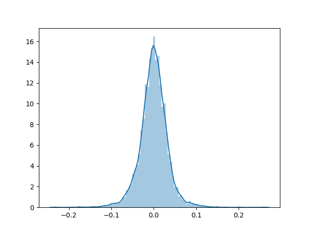
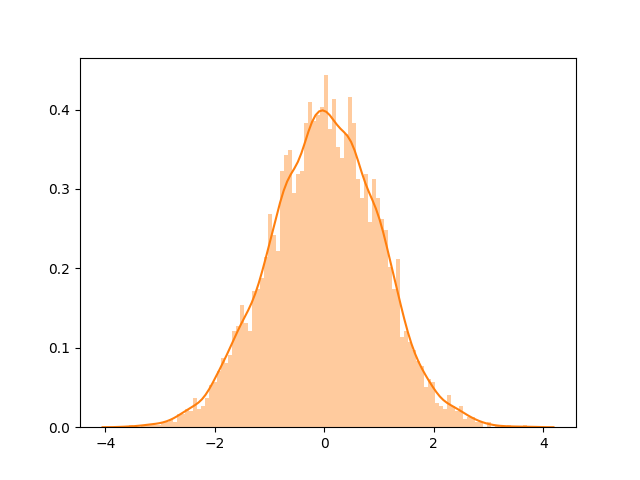

# Deep Stock Ranking

Working code repository for a deep learning stock ranking research project.

## Structure of this repository

```
src/quandl_import.py ................... Imports Quandl EOD dataset via bulk download API
src/datasets ........................... Datasets which subclass torch.utils.data.Dataset
src/lambertw ........................... Code to "Gaussianize" the dataset[3]
src/quantgan/preprocess.py ............. Applies the preprocessing discussed below
src/quantgan/quantgan_model.py ......... Framework for GAN model (not done)
src/nsort.py ........................... PyTorch implementation of [4]
src/wavenet ............................ WaveNet[5] implementation not by me
```


## Evaluating data

A universe of n = 2023 stock daily close prices are evaluated over roughly 20 years.

For a given stock, the following preprocessing steps are applied:

1. Log-returns are calculated
2. Normalize to unit variance and mean 0
3. Apply inverse Lambert W transform as described in [3]. This removes the heavy tails from our data.
4. Normalize to unit variance and mean 0 a second time
5. Apply rolling window of stride 1 and length equal to the receptive field of the WaveNet network.

#### Figure 1.1: Log-returns exhibit heavy tails



#### Figure 1.2: "Gaussianized" log-returns



### Statistics

| Statistic | Before    | After |
| --------- | ----------- | ----- |
| Kurtosis      | 7.25 | 3.00 |

### IGMM estimated parameters **𝜏ₓ** = ( μₓ, σₓ, δₓ )

|μₓ | σₓ | δₓ |
| --- | --- | --- |
| 5.10E-2 | 7.77E-1 | 1.48E-1 |

### Augumented Dickey-Fuller test

| Score | p-value | 1% | 5% | 10% |
| --- | --- | --- | --- | --- |
| -62.1 |0.0 | -3.44 | -2.86 | -2.57 |

## Road map

- [x] PyTorch implementation of Neuralsort
- [x] Quandl EOD data import into SQLite3 database
- [ ] Adapt WaveNet to *volatility-innovation* asset pricing model 
- [ ] Implement Quant GAN model to generate financial time series
  - [x] Lambert W transform
  - [x] Preprocess data as in [1].
  - [ ] Quant GAN data loader
  - [ ] Generator model
  - [ ] Discriminator model
- [ ] Evaluate various predictor models for input to Neuralsort using criteria of [6].

### Papers cited

<sup>[1] M. Wiese, R. Knobloch, R. Korn, P. Kretschmer, "Quant GANs: Deep Generation of Financial Time Series," arXiv:1907.06673v2 [q-fin.MF], Dec. 2019.</sup>

<sup>[2] M. Wiese, R. Knobloch, R. Korn, "Copula & Marginal Flows: Disentangling the Marginal from its Join," arXiv:1907.03361v1 [cs.LG], July 2019.</sup>

<sup>[3] G. M. Goerg, "The Lambert Way to Gaussianize heavy tailed data with the inverse of Tukey's h transformation as a special case," arXiv:1010.2265v5 [math.ST], Dec. 2012.</sup>

<sup>[4] A. Grover, E. Wong, A. Zweig, S. Ermon, "Stochastic Optimization of Sorting Networks via Continuous Relaxations," arXiv:1903.08850 [stat.ML]. Apr. 2019</sup>

<sup>[5] A. van den  Oord, et al., "WaveNet: A Generative Model for Raw Audio," arXiv:1609.03499v2 [cs.SD] Sep. 2016.</sup>

<sup>[6] Q. Song, A. Liu, S. Y. Yang, "Stock portfolio selection using learning-to-rank algorithms with news sentiment," *Neurocomputing*, vol. 264, pp. 20-28, Nov. 2017.</sup>

